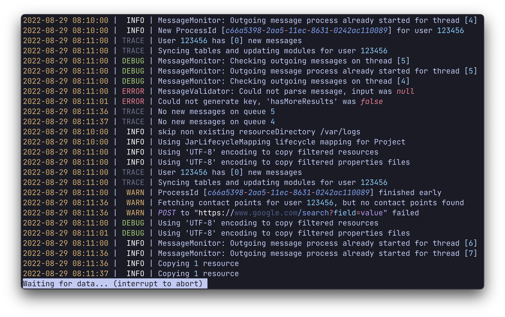

<p align="center">
  
</p>

# 

<p align="center">
A log file highlighter
</p>

<p align="center">
  
</p>

## Overview

`tailspin` is a command line tool for viewing (and `tail`-ing) log files. It highlights important keywords to make
navigating log files easier.

## Installing

### Homebrew

```console
# Install
brew install bensadeh/tailspin/tailspin

# Run
spin [file]
```

## See also

* [lnav](https://github.com/tstack/lnav)
* [grc](https://github.com/garabik/grc)

## Under the hood

`tailspin` uses:

* [`less`](http://greenwoodsoftware.com/less/)
* [Bubble Tea](https://github.com/charmbracelet/bubbletea) for handling control over to `less`
* [cobra](https://github.com/spf13/cobra) for the CLI
