<p align="center">
  
</p>

#                                                                                                                                                                                                                                                                                                                            

<p align="center">
A log file highlighter
</p>

<p align="center">
  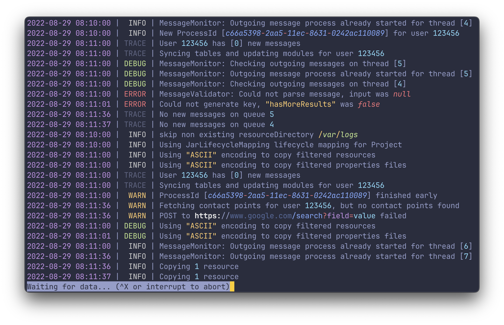
</p>

### Features

- 🪵 View (or `tail`) any log file of any format
- 🍰 No setup or config required
- 🌈 Highlights numbers, dates, IP-addresses, UUIDs, URLs and more
- ⚙️ All highlight groups are customizable
- 🧬 Easy to integrate with other commands
- 🔍 Uses `less` under the hood
- 📦 Powered by the [`manifold`](https://github.com/bensadeh/manifold) crate

#

### Table of Contents

* [Overview](#overview)
* [Usage](#usage)
* [Installing](#installing)
* [Highlight Groups](#highlight-groups)
* [Watching folders](#watching-folders)
* [Customizing Highlight Groups](#customizing-highlight-groups)
* [Working with `stdin` and `stdout`](#working-with-stdin-and-stdout)
* [Using the pager `less`](#using-the-pager-less)
* [Settings](#settings)

***

## Overview

`tailspin` works by reading through a log file line by line, running a series of regexes
against each line. The regexes recognize patterns you expect to find in a logfile, like dates, numbers, severity
keywords and more.

`tailspin` does not make any assumptions on the format or position of the items it wants to highlight. For this reason,
it requires no configuration and the highlighting will work consistently across different logfiles.

## Usage

The binary name for `tailspin` is `tspin`.

```console
# Read from file and view in `less`
tspin application.log

# Read from file and print to stdout
tspin application.log --print

# Read from stdin and print to stdout
kubectl logs [pod name] --follow | tspin

# Capture the stdout of another command and view in `less`
tspin --listen-command 'kubectl logs -f pod_name'
``` 

## Installing

### Package Managers

```console
# Homebrew
brew install tailspin

# Cargo
cargo install tailspin

# Archlinux
pacman -S tailspin

# Nix
nix-shell -p tailspin

# NetBSD
pkgin install tailspin

# FreeBSD
pkg install tailspin
```

### From Source

```console
cargo install --path .
```

Binary will be placed in `~/.cargo/bin`, make sure you add the folder to your `PATH` environment variable.

> [!IMPORTANT]
> When building from source, make sure that you are using the latest version
> of [`less`](http://greenwoodsoftware.com/less/).

## Highlight Groups

### Dates

<p align="center">
  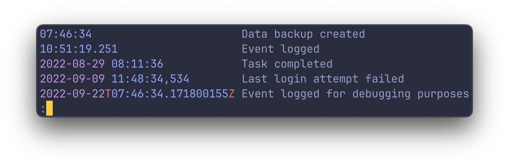
</p>

### Keywords

<p align="center">
  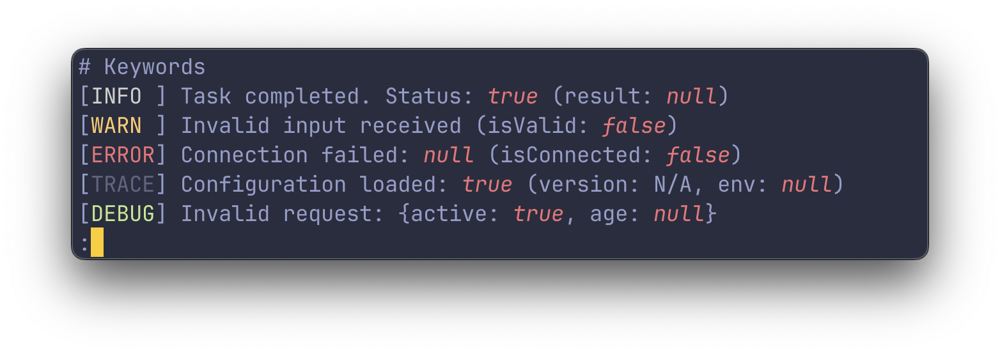
</p>

### URLs

<p align="center">
  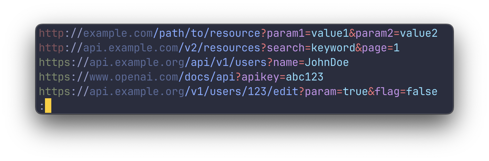
</p>

### Numbers

<p align="center">
  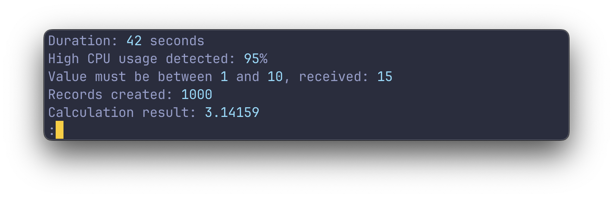
</p>

### IP Addresses

<p align="center">
  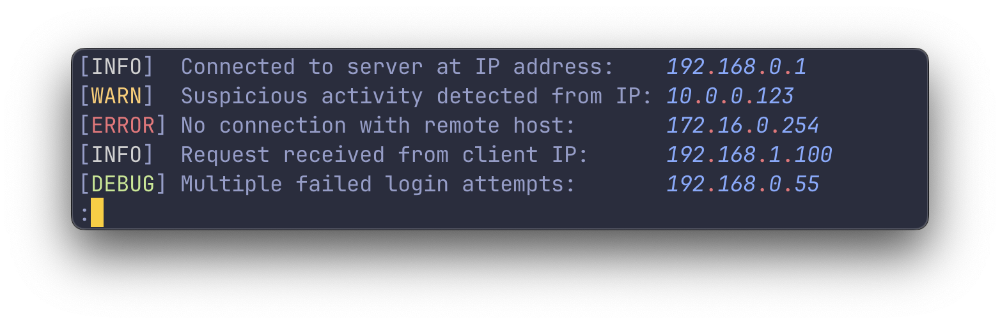
</p>

### Quotes

<p align="center">
  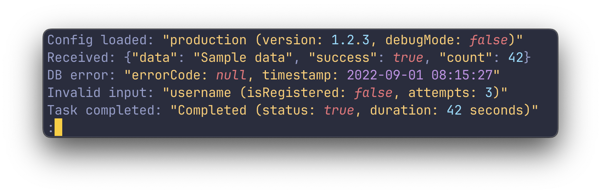
</p>

### Unix file paths

<p align="center">
  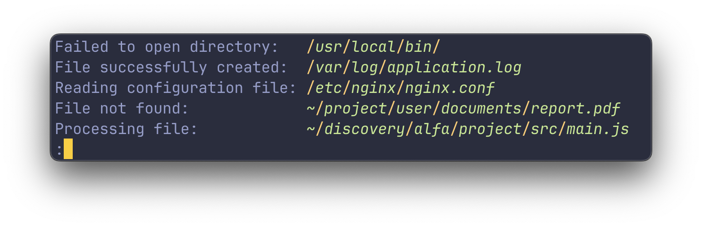
</p>

### HTTP methods

<p align="center">
  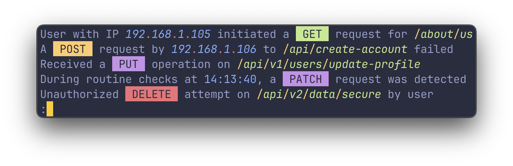
</p>

### UUIDs

<p align="center">
  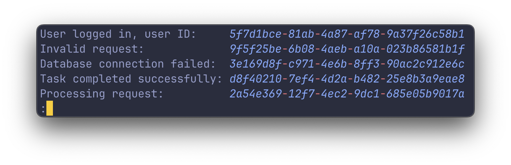
</p>

### Key-value pairs

<p align="center">
  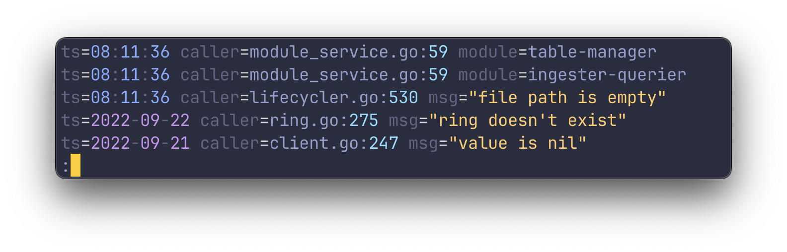
</p>

### Pointer addresses

<p align="center">
  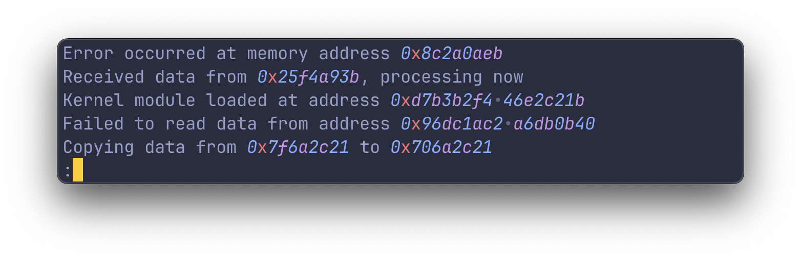
</p>

### Unix processes

<p align="center">
  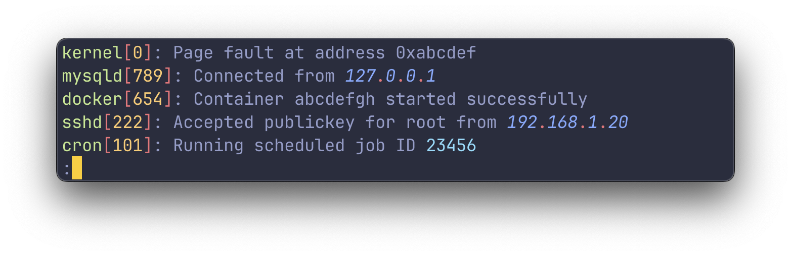
</p>

## Watching folders

`tailspin` can listen for newline entries in a given folder. Watching folders is useful for monitoring log files that
are rotated.

<p align="center">
  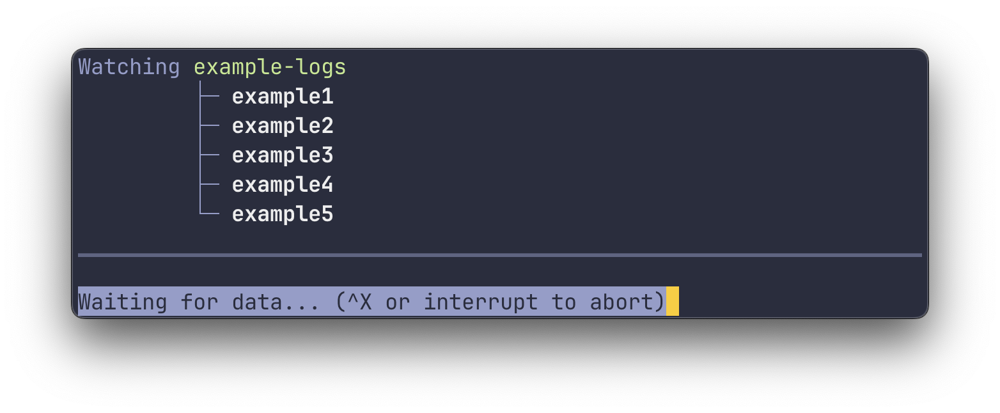
</p>

When watching folders, `tailspin` will start in follow mode (abort with <kbd>Ctrl + C</kbd>) and will only print
newline entries which arrive after the initial start.

## Customizing Highlight Groups

### Overview

Create a `theme.toml` in `~/.config/tailspin` to customize highlight groups.

Styles have the following shape:

```toml
style = { fg = "color", bg = "color", italic = false, bold = false, underline = false }
```

To edit the different highlight groups, include them in your `theme.toml` file. For example, to edit the `date`
highlight group, add the following to your `theme.toml`:

```toml
[date]
style = { fg = "green" }
```

Expand the section below to see the default config for the highlight groups:

<details>
<summary>Default highlight groups settings</summary>

```toml
[date]
date = { fg = "magenta" }
time = { fg = "blue" }
zone = { fg = "red" }
separator = { faint = true }

[[keywords]]
words = ['null', 'true', 'false']
style = { fg = "red", italic = true }

[[keywords]]
words = ['GET']
style = { fg = "black", bg = "green" }

[url]
http = { fg = "red", faint = true }
https = { fg = "green", faint = true }
host = { fg = "blue", faint = true }
path = { fg = "blue" }
query_params_key = { fg = "magenta" }
query_params_value = { fg = "cyan" }
symbols = { fg = "red" }

[number]
style = { fg = "cyan" }

[ip]
number = { fg = "blue", italic = true }
letter = { fg = "magenta", italic = true }
separator = { fg = "red" }

[quotes]
style = { fg = "yellow" }
token = '"'

[path]
segment = { fg = "green", italic = true }
separator = { fg = "yellow" }

[uuid]
number = { fg = "blue", italic = true }
letter = { fg = "magenta", italic = true }
separator = { fg = "red" }

[pointer]
number = { fg = "blue", italic = true }
letter = { fg = "magenta", italic = true }
separator = { fg = "red" }

[key_value]
key = { faint = true }
separator = { fg = "white" }

[process]
name = { fg = "green" }
separator = { fg = "red" }
id = { fg = "yellow" }

[json]
key = { fg = "yellow" }
quote_token = { fg = "yellow", faint = true }
curly_bracket = { faint = true }
square_bracket = { faint = true }
comma = { faint = true }
colon = { faint = true }
```

</details>

### Disabling Highlight Groups

To individually disable or enable highlight groups, use the `--enable` and `--disable` flags:

```console
# Enable only the url highlight group, disabling the rest
tspin application.log --enable=url

# Disable the numbers highlight group, keeping the rest
tspin application.log --disable=numbers
```

### Adding Keywords via theme.toml

To add custom keywords, either include them in the list of keywords or add new entries:

```toml
[[keywords]]
words = ['MyCustomKeyword']
style = { fg = "green" }

[[keywords]]
words = ['null', 'true', 'false']
style = { fg = "red", italic = true }
```

### Adding Keywords from the command line

Sometimes it is more convenient to add highlight groups on the fly without having to edit a TOML. To add highlights from
the command line, use the `--words-[red|green|yellow|blue|magenta|cyan]` flag followed by a comma separated list
of words to be highlighted.

<p align="center">
  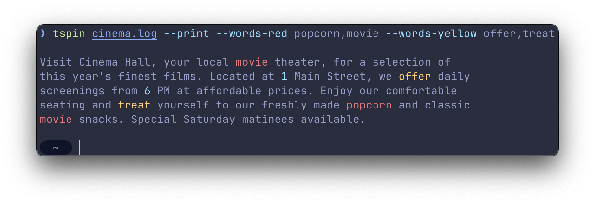
</p>

### Custom regex highlighters

When you need more control over the highlighting, you can use the regex highlighter. This highlighter allows you to
specify a regex and a style to be applied to the matched text.

It supports one capture group `()`. When found, it will apply the style to the captured text.

```toml
[[regexps]]
regex = 'Started (.*)\.'
style = { fg = "red" }
```

## Working with `stdin` and `stdout`

### Default behavior with pipes

By default, `tailspin` will open a file in the pager `less`. However, if you pipe something into `tailspin`, it will
print the highlighted output directly to `stdout`. This is similar to running `tspin [file] --print`.

To let `tailspin` highlight the logs of different commands, you can pipe the output of those commands into `tailspin`
like so:

```console
journalctl -f | tspin
cat /var/log/syslog | tspin
kubectl logs -f pod_name | tspin
```

### Capturing the output of a command and viewing it in `less`

To capture the output of a command and view it in `less`, use the `--listen-command` flag:

```console
tspin --listen-command 'kubectl logs -f pod_name'
```

This will run the command `kubectl logs -f pod_name` in the background and pipe the output to `tailspin`. The output
will be displayed in `less`, allowing you to navigate and search through the logs.

## Using the pager `less`

### Overview

`tailspin` uses `less` as its pager to view the highlighted log files. You can get more info on `less` via the **man**
command (`man less`) or by hitting the <kbd>h</kbd> button to access the help screen.

### Navigating

Navigating within `less` uses a set of keybindings that may be familiar to users of `vim` or other `vi`-like
editors. Here's a brief overview of the most useful navigation commands:

- <kbd>j</kbd>/<kbd>k</kbd>: Scroll one line up / down
- <kbd>d</kbd>/<kbd>u</kbd>: Scroll one half-page up / down
- <kbd>g</kbd>/<kbd>G</kbd>: Go to the top / bottom of the file

### Follow mode

When you run `tailspin` with the `-f` or `--follow` flag, it will scroll to the bottom and print new lines to the screen
as they're added to the file.

To stop following the file, interrupt with <kbd>Ctrl + C</kbd>. This will stop the tailing, but keep the
file open, allowing you to review the existing content.

To resume following the file from within `less`, press <kbd>Shift + F</kbd>.

### Search

Use <kbd>/</kbd> followed by your search query. For example, `/ERROR` finds the first occurrence of
**ERROR**.

After the search, <kbd>n</kbd> finds the next instance, and <kbd>N</kbd> finds the previous instance.

### Filtering

`less` allows filtering lines by a keyword, using <kbd>&</kbd> followed by the pattern. For instance, `&ERROR` shows
only lines with **ERROR**.

To only show lines containing either `ERROR` or `WARN`, use a regular expression: `&\(ERROR\|WARN\)`.

To clear the filter, use <kbd>&</kbd> with no pattern.

## Settings

```console
-f, --follow                     Follow the contents of the file
-e, --start-at-end               Start at the end of the file
-p, --print                      Print the output to stdout
-c, --listen-command '[CMD]'     Listen the output (stdout) of the provided command
    --config-path [PATH]         Use the configuration file from the provided path
    --words-[COLOR] [WORDS]      Highlight the provided words with the given color
    --no-builtin-keywords        Disable the highlighting of booleans, nulls, log severities and common REST verbs
    --enable=[HIGHLIGHT_GROUP]   Enable one or more highlight groups, disabling the rest
    --disable=[HIGHLIGHT_GROUP]  Disable one or more highlight groups, enabling the rest
```


